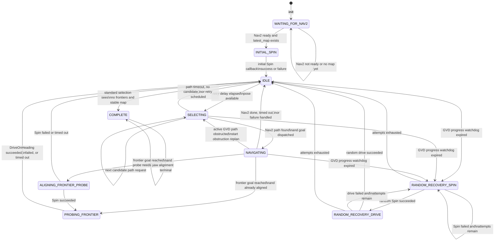
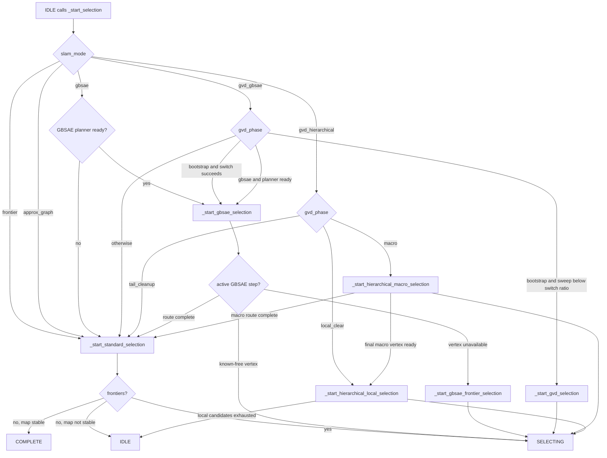
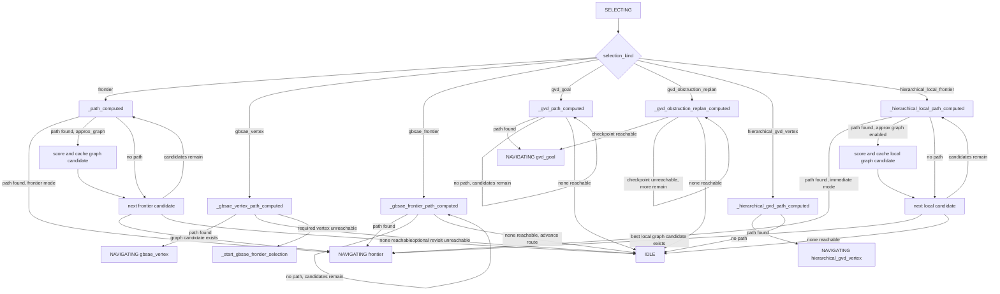
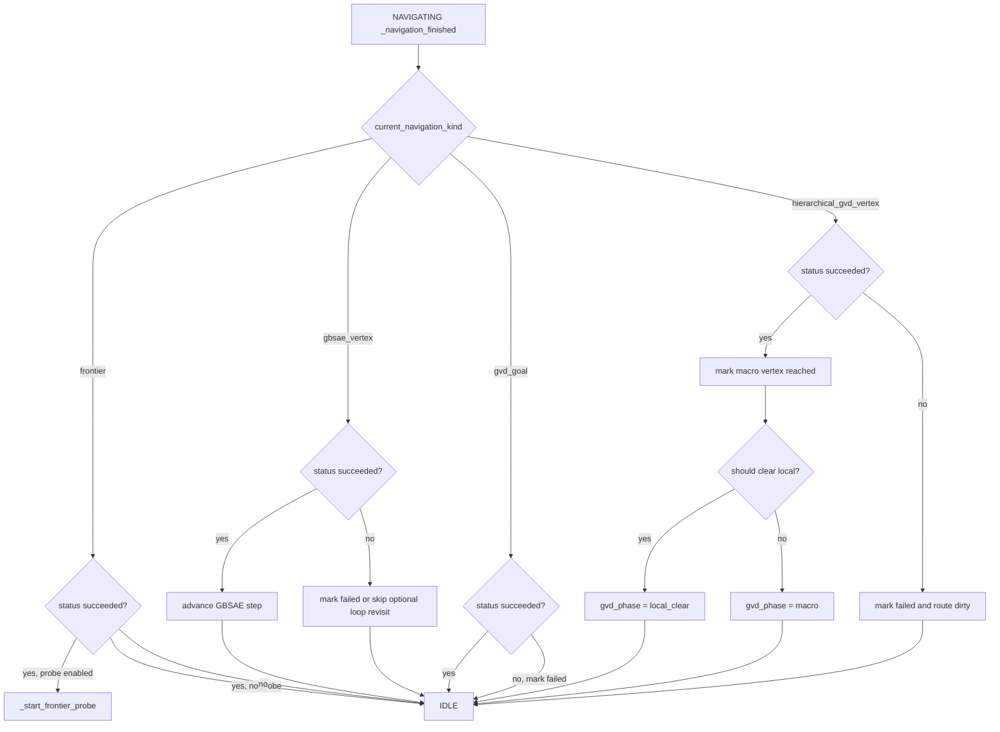
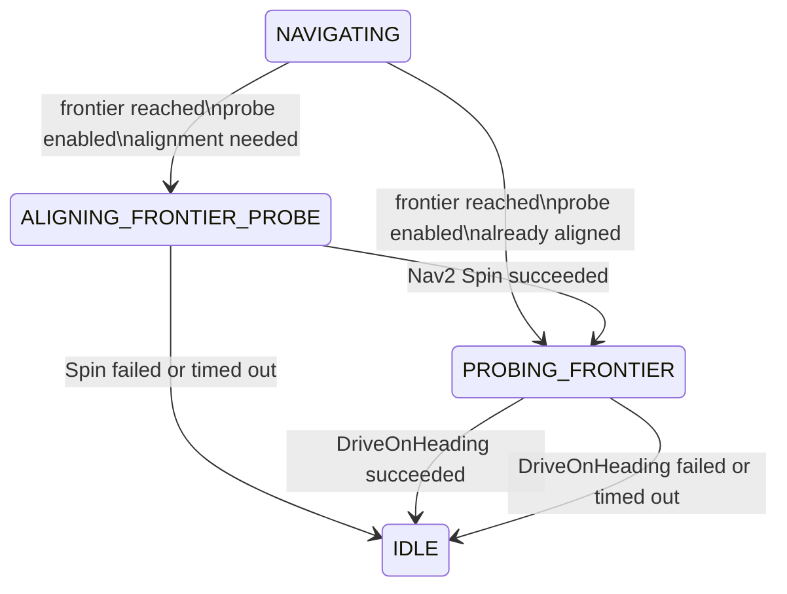
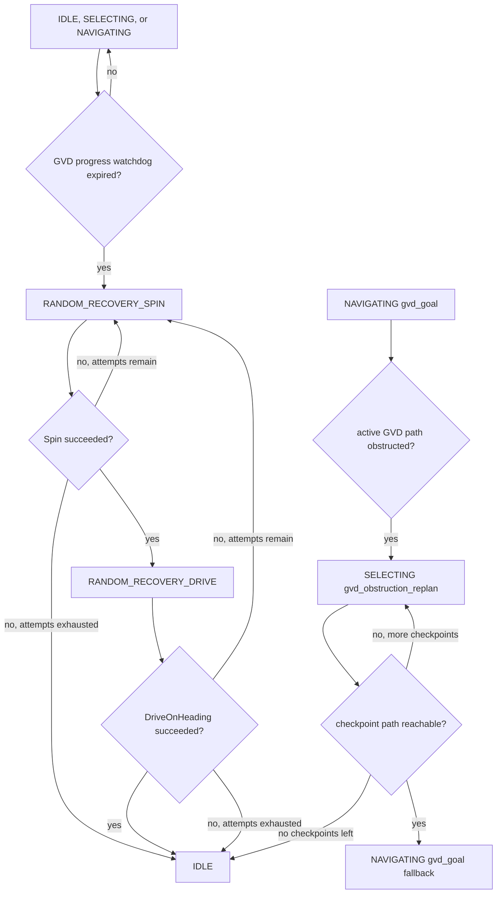

# Exploration Coordinator State Machine

This document summarizes the runtime state machine implemented by
`src/activeslam/activeslam/exploration_coordinator.py`.

The coordinator has one explicit `state` field, plus three mode-specific
substate fields that refine behavior while `state == SELECTING` or
`state == NAVIGATING`:

- `selection_kind`: `frontier`, `gbsae_vertex`, `gbsae_frontier`, `gvd_goal`,
  `gvd_obstruction_replan`, `hierarchical_gvd_vertex`, or
  `hierarchical_local_frontier`.
- `current_navigation_kind`: `frontier`, `gbsae_vertex`, `gvd_goal`, or
  `hierarchical_gvd_vertex`.
- `gvd_phase`: `bootstrap`, `gbsae`, `macro`, `local_clear`, or
  `tail_cleanup`, depending on `slam_mode`.

## Top-level state chart

## Selection dispatch by mode

## SELECTING callbacks

## NAVIGATING completion behavior

## Frontier probe sequence

## GVD recovery and obstruction replan

## Code anchors

- Explicit state constants are defined in `ExplorationCoordinator` near lines 98-107.
- `_control_loop()` owns the top-level dispatch, timeout checks, watchdog checks,
  and calls into selection from `IDLE`.
- `_start_selection()` dispatches to the mode-specific selection routines.
- `_schedule_retry()` is the common transition back to `IDLE`.
- `_navigation_finished()` handles `NAVIGATING` completion based on
  `current_navigation_kind`.
- `_start_frontier_probe()`, `_frontier_probe_spin_finished()`, and
  `_frontier_probe_drive_finished()` own the frontier probe substates.
- `_gvd_bootstrap_stuck()` and the `_gvd_random_recovery_*()` methods own the
  bounded GVD random recovery substates.
- `_handle_gvd_path_obstructed()` and `_gvd_obstruction_replan_computed()` own
  the GVD obstruction replan path through `SELECTING`.
